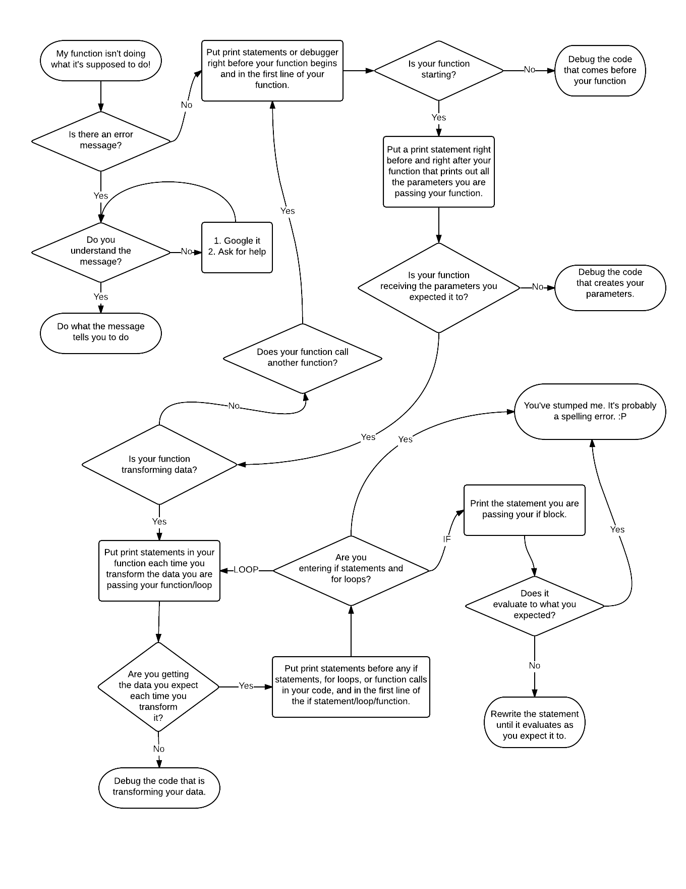

# Debugging
I'm just starting to learn javaScript and Ruby, an I thought that conceptualizing how I debug would be useful for me and hopefully for other people as well. Therefore...

##A flowchart for debugging your code
Obivously, this does not even begin to cover everything, but it seems like a good place to start.

##The basics
1. Be sure you know what you expect your function/loop/if statement to do.
2. Check to see if your function/loop/if statement is triggered when you expect it to be triggered.
3. Check to see if it is receiving the data that you think it should be receiving.
4. Check to see if the result is the result you are expecting.

##Tools for debugging
####Documentation
Sometimes methods don't work the way you think they do. It's never a bad idea to double check the docs to be sure that you are passing the correct arguments to your function, or that it's passing the arguments you expect to your block.

####Find
Use the find function in your text editor to be *very sure* that the variable you are calling has **exactly the same name** as the variable you declared.

####Linters
Linters are pretty good at catching syntax errors, so litening to what they tell you is probably a good place to start. No sense wasting time over a missing comma.

####Javascript
* console.log()
* use the console to set pauses in debugger, and while paused, investigate what's going on using the console
* write `debugger;` in your code to pause in debugger

####Ruby/Rails
* byebug gem
* `render json: <whatever you want to see>`
* p or puts

